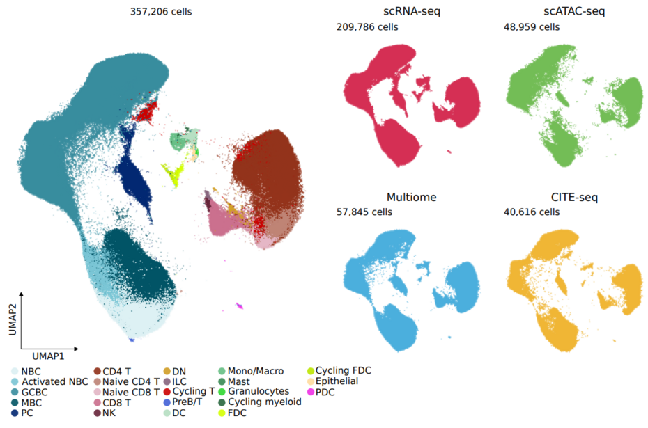
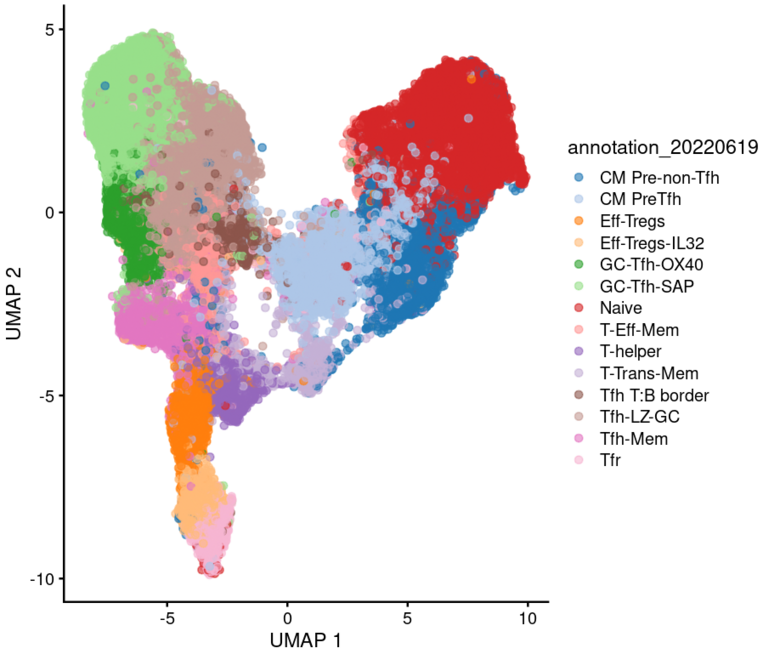

# HCATonsilData

HCATonsilData is an R/ExperimentHub package that provides easy access to single-cell RNA-seq (scRNA-seq), single-cell ATAC-seq (scATAC-seq), 10X Multiome, CITE-seq and spatial transcriptomics data (Visium) derived from the tonsil cell atlas project.



It is inspired in the [TabulaMurisSenisData](https://github.com/fmicompbio/TabulaMurisSenisData/blob/master/README.md) package


## Installation

HCATonsilData is available in BioConductor and can be installed as follows:

``` r
if (!require("BiocManager", quietly = TRUE))
    install.packages("BiocManager")

BiocManager::install("HCATonsilData")
```

Alternatively, you can install it from GitHub using the [devtools](https://github.com/hadley/devtools) package:

``` r
if (!require("devtools", quietly = TRUE))
    install.packages("devtools")

devtools::install_github("massonix/HCATonsilData", build_vignettes = TRUE)
```

## Documentation

HCATonsilData is a data package. As such, comprehensive documentation is an essential component of the package, and we provide it through the package vignette:

``` {r}
browseVignettes("HCATonsilData")
```

We provide access to `SingleCellExperiment` objects of the main cellular compartments
described in our manuscript. The function `listCellTypes` prints the available
cell types for a given assay (RNA, ATAC, CITE or Spatial):

``` {r}
listCellTypes(assayType = "RNA")
```
```
[1] "All"        "NBC-MBC"    "GCBC"       "PC"         "CD4-T"      "Th"         "CD8-T"      "ILC-NK"     "myeloid"   
[10] "FDC"        "epithelial" "PDC"        "preB"       "preT"
```

Note that for now HCATonsilAtlas only provides access to RNA data, but we are
working hard to extend it to other modalities, which are/will be arhived in 
[Zenodo](https://doi.org/10.5281/zenodo.6340174) as [Seurat objects](https://satijalab.org/seurat/).


Before installing a `SingleCellExperiment` object, we can get some information
(number of genes and cells) with the `HCATonsilDataInfo()` function:

``` {r}
HCATonsilDataInfo(cellType = "CD4-T")
```
```
snapshotDate(): 2022-04-26
see ?HCATonsilData and browseVignettes('HCATonsilData') for documentation
loading from cache
require(“S4Vectors”)
see ?HCATonsilData and browseVignettes('HCATonsilData') for documentation
loading from cache
Dataset: CD4-T (assay selected: RNA)
Measurements available for 37378 genes in 52307 cells
```

To obtain the `SingleCellExperiment` object associated with a given cell type we use
the `HCATonsilData()` function:

``` {r}
cd4_t <- HCATonsilData(assayType = "RNA", cellType = "CD4-T")
cd4_t
scater::plotUMAP(cd4_t, colour_by = "annotation_20220619")
```
```
class: SingleCellExperiment 
dim: 37378 52307 
metadata(0):
assays(2): counts logcounts
rownames(37378): AL627309.1 AL627309.3 ... AC136616.1 AC023491.2
rowData names(3): gene_name highly_variable gene_id
colnames(52307): bw94nf57_vm85woki_AAACCCAAGGTTGGTG-1
  bw94nf57_vm85woki_AAACCCAAGTCTTCGA-1 ... bs2e7lr7_mdfwypvz_TTTGTGGCAGGAATCG-1
  bs2e7lr7_mdfwypvz_TTTGTGTTCGAGGAGT-1
colData names(31): barcode donor_id ... UMAP_2_20220215 annotation_20220619
reducedDimNames(3): PCA UMAP HARMONY
mainExpName: NULL
altExpNames(0):
```



# Requirements

The data was uploaded to ExperimentHub in the release 3.15 of Bioconductor. Thus, you need to have
BioC >= 3.15 to be able to use the package. In addition, you will need R >=4.2.


# Annotations

Although we have put massive effort in annotating tonsillar cell types, cell type annotations are dynamic by nature. New literature or other interpretations of the
data can challenge and refine our annotations. To accomodate this, we have developed
the `updateAnnotation` function, which allows to periodically provide newer annotations as extra columns in the `colData` slot of the `SingleCellExperiment`
objects. If you want to contribute in one of these versions of the upcoming annotations,
please [open an issue](https://github.com/massonix/HCATonsilData/issues/new) and describe your annotation.

TODO: include glossary

# Reference

TODO some ref to the original publication, https://doi.org/10.1101/2022.06.24.497299 
TODO replace it once the manuscript is out
