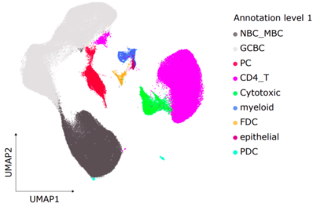
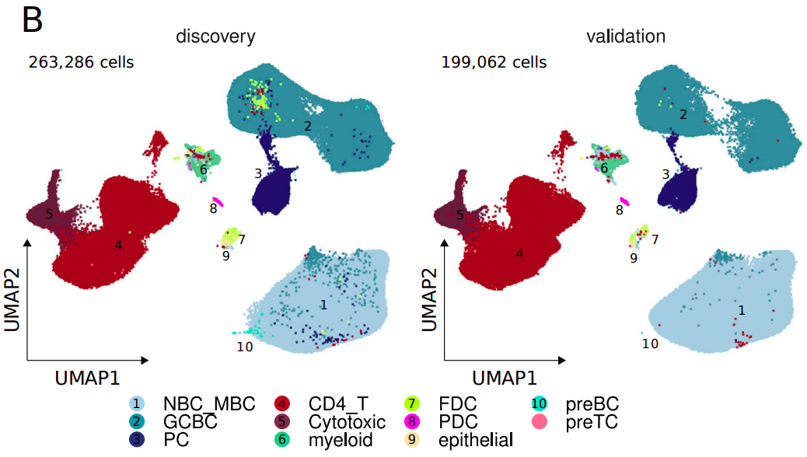
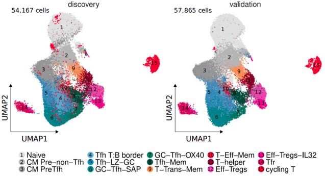

```{r, include = FALSE}
knitr::opts_chunk$set(
  collapse = TRUE,
  comment = "#>",
  eval = TRUE
)
```


# Introduction

Palatine tonsils are under constant exposure to antigens via the upper
respiratory tract, which makes them a compelling model secondary lymphoid organ
(SLO) to study the interplay between innate and adaptive immune cells
[@ruddle2009secondary]. Tonsils have a non-keratinizing stratified squamous
epithelium, organized into tubular, branched crypts that enlarge the tonsillar
surface. Within the crypts, microfold cells (or M cells) sample antigens at
their apical membrane. Subsequently, antigen presenting cells (APC), such as
dendritic cells (DC), process and present antigens to T cells in the
interfollicular or T cell zone. Alternatively, antigens are kept intact by
follicular dendritic cells (FDC) in lymphoid follicles, where they are
recognized by B cells [@nave2001morphology]. Such recognition triggers the
GC reaction, whereby naive B cells (NBC) undergo clonal selection,
proliferation, somatic hypermutation, class switch recombination (CSR) and
differentiation into long-lived plasma cells (PC) or memory B cells (MBC)
[@de2015dynamics].

In the context of the Human Cell Atlas (HCA) [@regev2018human], we have created 
a taxonomy of 121 cell types and states in a human tonsil. Since the transcriptome
is just a snapshot of a cell's state [@wagner2016revealing], we have added other
layers to define cell identity: single-cell resolved open chromatin epigenomic
landscapes (scATAC-seq and scRNA/ATAC-seq; i.e. Multiome) as well as protein
(CITE-seq), adaptive repertoire (single-cell B and T cell receptor sequencing;
i.e. scBCR-seq and scTCR-seq) and spatial transcriptomics (ST) profiles.

The HCATonsilData package aims to provide programmatic and modular access to the
datasets of the different modalities and cell types of the tonsil atlas.
HCATonsilData also documents how the dataset was generated and archived in
different repositories, from raw fastq files to processed datasets. It also
explains in detail the cell- and sample-level metadata, and allows users to
traceback the annotation of each cell type through detailed Glossary.


# Installation

HCATonsilData is available in BioConductor and can be installed as follows:

```{r eval=FALSE}
if (!require("BiocManager", quietly = TRUE))
    install.packages("BiocManager")

BiocManager::install("HCATonsilData")
```


Load the necessary packages in R:

```{r message=FALSE}
library("HCATonsilData")
library("SingleCellExperiment")
library("ExperimentHub")
library("scater")
library("ggplot2")
library("knitr")
library("kableExtra")
library("htmltools")
```


# Overview of the dataset

We obtained a total of 17 human tonsils, which covered three age groups:
children (n=6, 3-5 years), young adults (n=8, 19-35 years), and old adults
(n=3, 56-65 years). We collected them in a discovery cohort (n=10), which we
used to cluster and annotate cell types; and a validation cohort (n=7), 
which we used to validate the presence, annotation and markers of the discovered
cell types. The following table corresponds to the donor-level metadata:

```{r}
data("donor_metadata")

kable(
  donor_metadata,
  format = "markdown",
  caption = "Donor Metadata",
  align = "c"
) |> kable_styling(full_width = FALSE)
```


These tonsil samples were processed with different data modalities:

* scRNA-seq ([10X Chromium v3](https://www.10xgenomics.com/products/single-cell-gene-expression))
* scATAC-seq ([10X Chromium](https://www.10xgenomics.com/products/single-cell-atac))
* [10X Multiome](https://www.10xgenomics.com/products/single-cell-multiome-atac-plus-gene-expression): joint RNA and ATAC for each cell.
* [CITE-seq](https://www.nature.com/articles/nmeth.4380): joint transcriptome + ~200 protein surface markers for each cell.
* [Spatial transcriptomics]([10X Visium](https://www.10xgenomics.com/products/spatial-gene-expression))

The following heatmap informs about which samples were sequenced with which
technology and cohort type:

```{r, echo=FALSE, out.width = "100%"}
knitr::include_graphics("tonsil_atlas_cohort.png")
```


For each data modality, we mapped all raw fastq files with the appropriate flavor
of [cellranger](https://support.10xgenomics.com/single-cell-gene-expression/software/pipelines/latest/what-is-cell-ranger)
(e.g. cellranger-atac, spaceranger, etc), and analyzed all datasets within the
[Seurat](https://satijalab.org/seurat/) ecosystem [@hao2021integrated]. All
fastq files are deposited at EGA under accession number [EGAS00001006375](https://ega-archive.org/studies/EGAS00001006375).
The expression and accessibility matrices are deposited in Zenodo under record [6678331](https://zenodo.org/record/6678331).
The Seurat objects from which the data of this repository is derived are archived in Zenodo under record [8373756](https://zenodo.org/record/8373756).
Finally, the GitHub repository [Single-Cell-Genomics-Group-CNAG-CRG/TonsilAtlas](https://github.com/Single-Cell-Genomics-Group-CNAG-CRG/TonsilAtlas) documents the full
end-to-end analysis, from raw data to final Seurat objects and figures in the paper.

To define the tonsillar cell types, we first aimed to cluster cells using
the combined expression data from scRNA-seq, Multiome and CITE-seq datasets.
However, we noticed that with CITE-seq we detected 2.75X and 2.98X fewer genes
than with scRNA-seq and Multiome, respectively:


```{r, echo=FALSE, out.width = "100%"}
knitr::include_graphics("tonsil_atlas_n_detected_genes.png")
```

Because we did not want to bias the clustering towards the modality that
provides less information, we first analyzed scRNA-seq and Multiome together,
and used CITE-seq to validate the annotation (see below). However, a recent
benchmarking effort showed that scRNA-seq and single-nuclei RNA-seq (such as
Multiome) mix very poorly [@mereu2020benchmarking]. Indeed, we observed massive
batch effects between both modalities (see manuscript). To overcome it, we
found highly variable genes (HVG) for each modality independently. We then
intersected both sets of HVG to remove modality-specific variation. Following
principal component analysis (PCA), we integrated scRNA-seq and Multiome with
Harmony [@korsunsky2019fast]. Harmony scales well to atlas-level datasets
and ranks among the best-performing tools in different benchmarks.

These steps are performed using [SLOcatoR](https://github.com/massonix/SLOcatoR)
(see methods of the paper), which allowed 1. to remove batch effects between
scRNA-seq and Multiome, 2. to transfer cell type labels from Multiome to scATAC-seq,
and from scRNA-seq to CITE-seq. Thus, this strategy allowed us to annotate clusters
using information across multiple modalities (RNA expression, protein expression,
TF motifs, etc.).

Note: we provide SLOcatoR as an R package to promote reproducibility and
best practices in scientific computing, but we refer the users to properly
benchmarked tools to annotate their datasets such as
[Azimuth](https://www.cell.com/cell/fulltext/S0092-8674%2821%2900583-3),
[scArches](https://www.nature.com/articles/s41587-021-01001-7),
or [Symphony](https://www.nature.com/articles/s41467-021-25957-x).


Within the discovery cohort, we first defined 9 main compartments: (1) NBC and MBC,
(2) GC B cells (GCBC), (3) PC, (4) CD4 T cells, (5) cytotoxic cells
[CD8 T cells, NK, ILC, double negative T cells (DN)], (6) myeloid cells
(DC, macrophages, monocytes, granulocytes, mast cells), (7) FDC, (8) epithelial
cells and (9) plasmacytoid dendritic cells (PDC):

```{r, echo=FALSE, out.width = "100%"}

```

Subsequently, we clustered and annotated cell subtypes within each of the main
compartments, giving rise to the 121 cell types and states in the atlas. The
following UMAPs inform about the main cell populations and number of cells
per assay in the discovery cohort:

```{r, echo=FALSE, out.width = "100%"}
knitr::include_graphics("tonsil_atlas_umaps.png")
```

We then applied SLOcatoR to annotate cells from the validation cohort (1) to confirm
the presence, annotation and markers of cell types; (2) to extend the atlas
through an integrated validation dataset, and (3) to chart compositional
changes in the tonsil during aging. The integrated tonsil atlas represented
over 462,000 single-cell transcriptomes:

```{r, echo=FALSE, out.width = "100%"}

```

Finally, we focused again on each of the 9 compartments and retransferred the
final annotation level. As an example, here we can see the transferred annotation
for CD4 T cells, from discovery to validation cohort:

```{r, echo=FALSE, out.width = "100%"}

```

Overall, we could validate most of the cell types, as they preserved their
marker genes and had a high annotation confidence in the validation cohort.
However, (1) transient cell states, (2) underrepresented cell types, or
(3) clusters that are at the intersection between two main compartments (and
might represent doublets) had low annotation confidences. We provide this
interpretation in the Glossary (see below).


# Assay types

HCATonsilData provides access to 5 main types of assays: RNA, ATAC, Multiome, 
CITE-seq and Spatial.


## scRNA-seq

We can obtain the `SingleCellExperiment` object with gene expression (RNA)
data as follows:

```{r eval=FALSE}
(sce <- HCATonsilData(assayType = "RNA", cellType = "All"))
table(sce$assay)
```

This object consists of 377,988 profiled with scRNA-seq (3P)
and 84,364 cells profiled with multiome, for a total of 462,352 cells (37,378
genes were quantified across all of these).

We can dowload a `SingleCellExperiment` object specific to each of the main 
subpopulations defined at level 1 as follows:

```{r}
listCellTypes(assayType = "RNA")
(epithelial <- HCATonsilData(assayType = "RNA", cellType = "epithelial"))
data("colors_20230508")
scater::plotUMAP(epithelial, colour_by = "annotation_20230508") +
  ggplot2::scale_color_manual(values = colors_20230508$epithelial) +
  ggplot2::theme(legend.title = ggplot2::element_blank())
```

As we can see, we can use the same colors as in the publication using the
`colors_20230508` variable.

We can also download datasets from the preprint (discovery cohort, version 1.0) - 
we first load a list of matched annotations used throughout the course of the 
project, used internally by the main `HCATonsilData()` function:

```{r}
data("annotations_dictionary")
annotations_dictionary[["dict_20220619_to_20230508"]]

# load also a predefined palette of colors, to match the ones used in the manuscript 
data("colors_20230508")

(epithelial_discovery <- HCATonsilData("RNA", "epithelial", version = "1.0"))
scater::plotUMAP(epithelial, colour_by = "annotation_20230508") +
  ggplot2::scale_color_manual(values = colors_20230508$epithelial) +
  ggplot2::theme(legend.title = ggplot2::element_blank())
```

Here's a brief explanation of all the variables in the colData slot of the
`SingleCellExperiment` objects:


* barcode: the cell barcode. Combination of [GEM well](https://support.10xgenomics.com/single-cell-gene-expression/software/pipelines/latest/glossary) and cellranger 10X barcode.
* donor_id: the donor-specific identifier, which can be used to retrieve donor-level metadata form the table above.
* gem_id: we gave a unique hashtag to each [GEM well](https://support.10xgenomics.com/single-cell-gene-expression/software/pipelines/latest/glossary) (10X Chip Channel) in our dataset. This allows to traceback all the metadata for a given cell.       
* library_name: each GEM well can give rise to multiple Illumina libraries. For example, one Multiome GEM well will give rise to 2 illumina libraries (ATAC and RNA).
* assay: 3P (scRNA-seq) or multiome
* sex
* age
* age_group: kid, young adult, old adult
* hospital: hospital where the tonsils where obtained [Hospital Clinic](https://www.clinicbarcelona.org/), [CIMA](https://cima.cun.es/), or Newcastle.
* cohort_type: discovery or validation cohort
* cause_for_tonsillectomy: condition that led to the tonsillectomy (e.g. tonsillitis, sleep apnea, etc.)
* is_hashed: whether we used [cell hashing](https://genomebiology.biomedcentral.com/articles/10.1186/s13059-018-1603-1) or not.
* preservation: whether we processed the sample fresh or frozen.
* nCount_RNA, nFeature_RNA: number of counts and features (genes) detected per cell.
* pct_mt, pct_ribosomal: percentage of counts that map to mitochondrial (^MT) or ribosomal (^RPS) genes.
* pDNN_hashing, pDNN_scrublet, pDNN_union: proportion of doublet nearest neighbors (pDNN) using different doublet annotations.
* S.Score, G2M.Score Phase, CC.Difference: outputs of the [CellCycleScoring](https://rdrr.io/cran/Seurat/man/CellCycleScoring.html) from `Seurat`.
* scrublet_doublet_scores: doublet score obtained with [Scrublet](https://www.cell.com/cell-systems/fulltext/S2405-4712(18)30474-5?_returnURL=https%3A%2F%2Flinkinghub.elsevier.com%2Fretrieve%2Fpii%2FS2405471218304745%3Fshowall%3Dtrue)
* scrublet_predicted_doublet: doublet annotation obtained with Scirpy (doublet or singlet)
* doublet_score_scDblFinder: doublet score obtained with [scDblFinder](https://f1000research.com/articles/10-979), which was run in the validation cohort following [the most recent best practices for single-cell analysis](https://www.nature.com/articles/s41576-023-00586-w).
* annotation_level_1: annotation used at our level 1 clustering (9 main compartments).
* annotation_level_1_probability: annotation confidence for the level 1 annotation (relevant for validation cohort, as it implied KNN annotation)
* annotation_figure_1: annotation used in the figure 1 of our manuscript. This annotation consisted of grouping the final subtypes into main cell types that were distinguishable in the UMAP.
* annotation_20220215, annotation_20220619, annotation_20230508: time-stamped annotation for cell types.
* annotation_20230508_probability: annotation confidence for the final annotation (relevant for validation cohort, as it implied KNN annotation)
* UMAP_1_level_1, UMAP_2_level_1: UMAP1 coordinates of the figure 1B of the article.
* annotation_20220215: see above.
* UMAP_1_20220215, UMAP_2_20220215: UMAP coordinates used in figures of the preprint for each cell type.


## scATAC-seq and Multiome

Since there is not a popular Bioconductor package to analyze or store scATAC-seq data,
we point users to the scATAC-seq and Multiome Seurat objects that we created
using [Signac](https://stuartlab.org/signac/) [@stuart2021single].

Here are the instructions to download the scATAC-seq object (approximately ~9.3 Gb in size):

```{r eval=FALSE}
library("Seurat")
library("Signac")

download_dir = tempdir()

options(timeout = 10000000)
atac_url <- "https://zenodo.org/record/8373756/files/TonsilAtlasSeuratATAC.tar.gz"
download.file(
  url = atac_url, 
  destfile = file.path(download_dir, "TonsilAtlasSeuratATAC.tar.gz")
)
# Advice: check that the md5sum is the same as the one in Zenodo
untar(
  tarfile = file.path(download_dir, "TonsilAtlasSeuratATAC.tar.gz"), 
  exdir = download_dir
)
atac_seurat <- readRDS(
  file.path(download_dir, "scATAC-seq/20230911_tonsil_atlas_atac_seurat_obj.rds")
)
atac_seurat
```


The multiome object contains 68,749 cells that passed both RNA and ATAC QC filters.
Here are the instructions to download the Multiome object (approximately ~5.7 Gb in size):

```{r eval=FALSE}
library("Seurat")
library("Signac")

download_dir = tempdir()

options(timeout = 10000000)
multiome_url <- "https://zenodo.org/record/8373756/files/TonsilAtlasSeuratMultiome.tar.gz"
download.file(
  url = multiome_url, 
  destfile = file.path(download_dir, "TonsilAtlasSeuratMultiome.tar.gz")
)
# Advice: check that the md5sum is the same as the one in Zenodo
untar(
  tarfile = file.path(download_dir, "TonsilAtlasSeuratMultiome.tar.gz"), 
  exdir = download_dir
)
multiome_seurat <- readRDS(
  file.path(download_dir, "/multiome/20230911_tonsil_atlas_multiome_seurat_obj.rds")
)
multiome_seurat
```


**Note**: we may version these two objects in Zenodo to polish the annotation.
Therefore, we recommend users to check that this is the most updated version
of the object in Zenodo.

To recall peaks or visualize chromatin tracks, it is essential to have access to
the [fragments file](https://support.10xgenomics.com/single-cell-atac/software/pipelines/latest/output/fragments).
We modified the original fragments files generated by
cellranger-atac or cellranger-arc to include the [gem_id](https://support.10xgenomics.com/single-cell-gene-expression/software/pipelines/latest/glossary)
as prefix. These files can be downloaded as follows (approximate size of ~26.0 Gb, feel free to grab a coffee in the meanwhile):

```{r eval=FALSE}
download_dir = tempdir()

fragments_url <- "https://zenodo.org/record/8373756/files/fragments_files.tar.gz"
download.file(
  url = fragments_url, 
  destfile = file.path(download_dir, "fragments_files.tar.gz")
)
untar(
  tarfile = file.path(download_dir, "fragments_files.tar.gz"),
  exdir = download_dir
)
```

**Note**: it is paramount to update the paths to the fragments files in each
ChromatinAssay object using the [UpdatePath](https://stuartlab.org/signac/reference/updatepath)
function.

The chromatin accessibility side of these objects was processed using the
general pipeline from [Signac](https://stuartlab.org/signac/articles/pbmc_vignette). Briefly:

* We called peaks using [MACS2](https://pypi.org/project/MACS2/) (as implemented in the [CallPeaks](https://www.rdocumentation.org/packages/Signac/versions/1.10.0/topics/CallPeaks) function), generating pseudobulks for each of the main 9 compartments.
* We quantified the accessibility for each peak and each cell using the [FeatureMatrix](https://stuartlab.org/signac/reference/featurematrix) function.
* We normalized data using the term frequency inverse document frequency (TF-IDF) normalization, as implemented in the [RunTFIDF](https://stuartlab.org/signac/reference/runtfidf) function.
* We reduced the dimensionality using latent semantic indexing ([RunLSI](https://www.rdocumentation.org/packages/Seurat/versions/3.1.4/topics/RunLSI) function)

For Multiome, we additionally computed a weighted KNN graph with the
[FindMultiModalNeighbors](https://satijalab.org/seurat/reference/findmultimodalneighbors) function.

Many variables in the metadata slot are shared with scRNA-seq. Here, we explain
the meaning of the variables that are specific to Multiome or scATAC-seq:

* nCount_ATAC: total number of counts per cell
* nFeature_ATAC: total number of peaks detected per cell
* is_facs_sorted: whether that particular sample was FACS-sorted to eliminate dead cells
* nucleosome_signal: as explained in Signac, *Nucleosome banding pattern: The histogram of DNA fragment sizes (determined from the paired-end sequencing reads) should exhibit a strong nucleosome banding pattern corresponding to the length of DNA wrapped around a single nucleosome. We calculate this per single cell, and quantify the approximate ratio of mononucleosomal to nucleosome-free fragments*
* nucleosome_percentile: percentile rank of each ratio of mononucleosomal to nucleosome-free fragments per cell (see [NucleosomeSignal](https://stuartlab.org/signac/reference/nucleosomesignal) function)
* TSS.enrichment: as explained in Signac, *The ENCODE project has defined an ATAC-seq targeting score based on the ratio of fragments centered at the TSS to fragments in TSS-flanking regions (see https://www.encodeproject.org/data-standards/terms/). Poor ATAC-seq experiments typically will have a low TSS enrichment score.*
* TSS.percentile
* RNA.weight: the weight that RNA has in the weighted nearest neighbor graph per cell (multiome-specific)
* ATAC.weight: the weight that RNA has in the weighted nearest neighbor graph per cell (multiome-specific)


## CITE-seq

The CITE-seq object can be downloaded as follows (approximate size of ~0.4 Gb):

```{r eval=FALSE}
library("Seurat")

download_dir = tempdir()

options(timeout = 10000000)
cite_url <- "https://zenodo.org/record/8373756/files/TonsilAtlasSeuratCITE.tar.gz"
download.file(
  url = cite_url, 
  destfile = file.path(download_dir, "TonsilAtlasSeuratCITE.tar.gz")
)
# Advice: check that the md5sum is the same as the one in Zenodo
untar(
  tarfile = file.path(download_dir, "TonsilAtlasSeuratCITE.tar.gz"), 
  exdir = download_dir
)

cite_seurat <- readRDS(
  file.path(download_dir, "CITE-seq/20220215_tonsil_atlas_cite_seurat_obj.rds")
)
cite_seurat
```


Together with CITE-seq, we also applied scBCR-seq and scTCR-seq. This data was
analyzed with [scirpy](https://academic.oup.com/bioinformatics/article/36/18/4817/5866543),
[@sturm2020scirpy] and we provide the main output of this analysis (for cytotoxic cells) as a
dataframe, which can be imported as follows:

```{r eval=FALSE}
scirpy_df <- read.csv(
  file = file.path(download_dir, "CITE-seq/scirpy_tcr_output.tsv"),
  header = TRUE
)

head(scirpy_df)
```


## Spatial transcriptomics

A `r BiocStyle::Biocpkg("SpatialExperiment")` of the [spatial transcriptomics]([10X Visium](https://www.10xgenomics.com/products/spatial-gene-expression)) dataset may be retrieved via `assayType="Spatial"`. The dataset contains 8 tissue slices with ~1,000-3,000 cells each that were profiled on two separated slides, as well as a low-resolution (H&E staining) image for each slice.

```{r eval=FALSE}
library("SpatialExperiment")
(spe <- HCATonsilData(assayType = "Spatial"))
```


To plot gene expression you can use the ggspavis package:

```{r eval=FALSE}
library("ggspavis")
sub <- spe[, spe$sample_id == "esvq52_nluss5"]
plt <- plotVisium(sub, fill="SELENOP") + 
  scale_fill_gradientn(colors=rev(hcl.colors(9, "Spectral")))
plt$layers[[2]]$aes_params$size <- 1.5
plt$layers[[2]]$aes_params$alpha <- 1
plt$layers[[2]]$aes_params$stroke <- NA
plt
```


# Annotations of the Tonsil Data Atlas

To allow users to traceback the rationale behind each and every of our annotations,
we provide a detailed glossary of 121 cell types and states and related functions
to get the explanation, markers and references of every annotation. You can access
the glossary as a dataframe as follows:


```{r}
glossary_df <- TonsilData_glossary()
head(glossary_df)
```


To get the glossary for each cell type with nice printing formatting you can use
the `TonsilData_cellinfo()` function:

```{r}
TonsilData_cellinfo("Tfr")
```


Alternatively, you can get a static html with links to markers and articles with
`TonsilData_cellinfo_html`

```{r eval = TRUE}
htmltools::includeHTML(
  TonsilData_cellinfo_html("Tfr", display_plot = TRUE)
)
```


Although we have put massive effort in annotating tonsillar cell types, cell type
annotations are dynamic by nature. New literature or other interpretations of the
data can challenge and refine our annotations. To accommodate this, we have developed
the `updateAnnotation` function, which allows to periodically provide newer
annotations as extra columns in the `colData` slot of the `SingleCellExperiment`
objects. If you want to contribute in one of these versions of the upcoming annotations,
please [open an issue](https://github.com/massonix/HCATonsilData/issues/new) and
describe your annotation.


# Interoperability with other frameworks

While we provide data in the form of SingleCellExperiment objects, you may want to
analyze your data using a different single-cell data container. In future releases,
we will strive to make the SingleCellExperiment objects compatible with
[Seurat v5](https://github.com/satijalab/seurat), which will come out after this
release of BioConductor. Alternatively, you may want to obtain
[AnnData](https://anndata.readthedocs.io/en/latest/) objects to analyze your data
in [scanpy](https://scanpy.readthedocs.io/en/stable/installation.html) ecosystem.
You can convert and save the data as follows:

```{r eval=FALSE}
library("zellkonverter")
epithelial <- HCATonsilData(assayType = "RNA", cellType = "epithelial")
writeH5AD(sce = epithelial, file = "epithelial.h5ad")
```

The SingleCellExperiment objects obtained via `HCATonsilData()` can be explored in 
detail using e.g. additional Bioconductor packages, such as the `iSEE` package.

This can be as simple as executing this chunk:

```{r launchisee, eval=FALSE}
if (require(iSEE)) {
  iSEE(epithelial)
}
```
 
# Session information {-}

```{r}
sessionInfo()
```


# References
