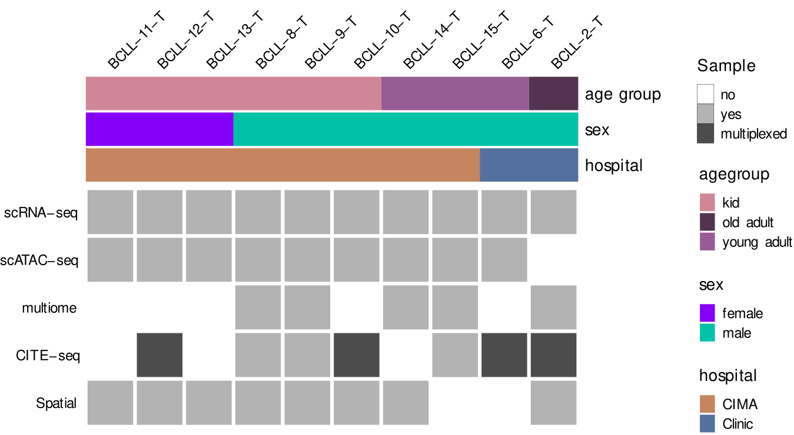
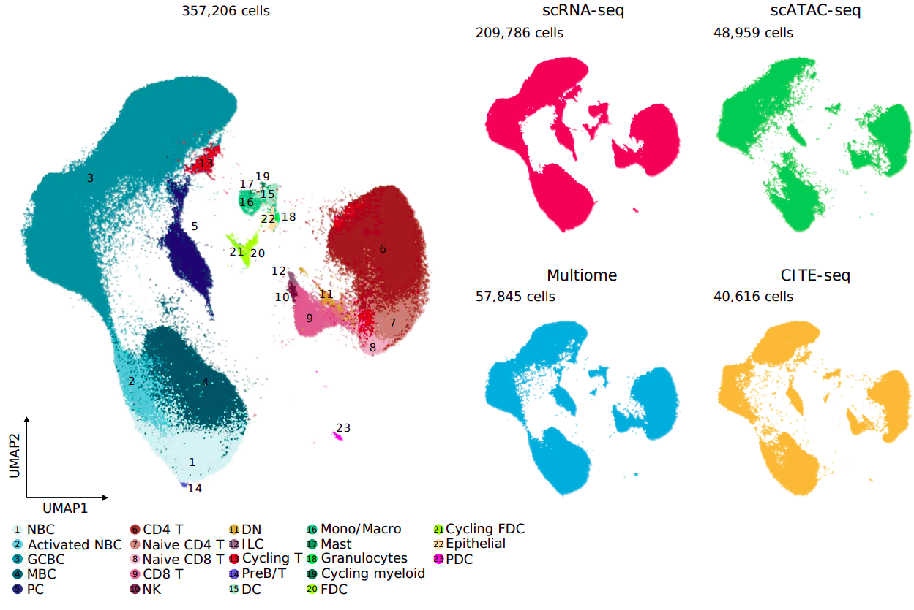
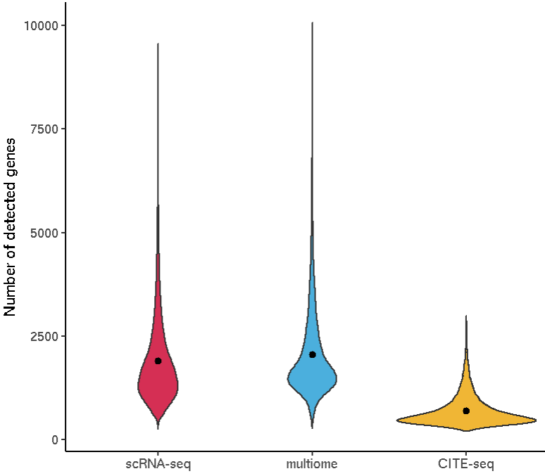

```{r, include = FALSE}
knitr::opts_chunk$set(
  collapse = TRUE,
  comment = "#>"
)
```


# Introduction

Secondary lymphoid organs (SLO) are essential to develop tolerance and adaptive
immunity against self or foreign antigens, respectively. They include lymph
nodes, spleen, Peyer’s Patches, mucosal-associated lymphoid tissue (MALT) and
the Waldeyer's tonsillar ring (including pharyngeal, adenoids, tubal, lingual
and palatine tonsils). Tonsils are located strategically at the intersection
between the respiratory and digestive tracts, where they are bombarded with
antigens. In this setting, tonsils have large and active germinal centers,
which makes them an appealing organ for the study of the interplay between
innate and adaptive immune cells, their role in follicular and germinal center
development and in the formation of active adaptive immunity and respective
memory. In addition, tonsils are routinely obtained in hospitals, making them
an overall great model SLO [@ruddle2009secondary].

In the context of the Human Cell Atlas (HCA) [@regev2018human], we have created a taxonomy of cell
types and states in a human tonsil. Because the transcritpome is just a snapshot
of a cell's state, we have added other layers to define cell identity: 
single-cell resolved open chromatin epigenomic landscapes (scATAC-seq and
scRNA/ATAC-seq; i.e. Multiome) as well as protein (CITE-seq), adaptive
repertoire (single-cell B and T cell receptor sequencing; i.e. scBCR-seq and
scTCR-seq) and spatial transcriptomics (ST) profiles.

The HCATonsilData package aims to provide programmatic and modular access to the
datasets of the different modalities and cells types of the tonsil atlas.


# Installation

```{r eval=FALSE}
devtools::install_github("massonix/HCATonsilData", build_vignettes = TRUE)
```

Once we have installed the package, we can load it:

```{r message=FALSE}
library(HCATonsilData)
library(SingleCellExperiment)
library(ExperimentHub)
library(ggplot2)
```


# Overview of the dataset

We obtained a total of ten human tonsils. These tonsils covered
three age groups: kids (n=6, 3-5 years), young adults (n=3, 26-35 years) and
old adults (n=1, 65 years). Here's a more detailed explanation of the different
types of assay:

* scRNA-seq ([10X Chromium v3](https://www.10xgenomics.com/products/single-cell-gene-expression))
* scATAC-seq ([10X Chromium](https://www.10xgenomics.com/products/single-cell-atac))
* [10X Multiome](https://www.10xgenomics.com/products/single-cell-multiome-atac-plus-gene-expression): joint RNA and ATAC for each cell.
* [CITE-seq](https://www.nature.com/articles/nmeth.4380): joint transcriptome + ~200 protein surface markers for each cell.
* [Spatial transcriptomics]([10X Visium](https://www.10xgenomics.com/products/spatial-gene-expression))

The following heatmap informs about which samples where sequenced with which
technology:

```{r, echo=FALSE, out.width = "100%"}

```


The following UMAPs inform about the main cell populations and number of cells
per assay:

```{r, echo=FALSE, out.width = "100%"}

```


The dataset was originally analyzed with [Seurat](https://satijalab.org/seurat/).
[@hao2021integrated] Important links:

* [Github repository with the full set of Rmd notebooks needed to go from raw expression matrices to the final objects](TODO add link).
* [Zenodo repository where we deposited the Seurat objects](https://zenodo.org/record/6340174/#.Yl7BH39BxH4).


# Assay types

HCATonsilData provides access to 4 main types of assays: RNA, ATAC, CITE-seq and
Spatial.

## RNA

We can obtain the `SingleCellExperiment` object with transcriptomics (RNA)
data as follows:

```{r}
(sce <- HCATonsilData(assayType = "RNA", cellType = "All"))
table(sce$assay)
```


As you can see, this object consists of 209786 profiled with scRNA-seq (3P)
and 53513 cells profiled with multiome. Initially, we aimed to also use CITE-seq
to cluster cells in our tonsil atlas. However, we noticed that with CITE-seq we
detected 2.75X and 2.98X fewer genes than with scRNA-seq and Multiome, respectively:

```{r eval=FALSE, echo=FALSE}
df <- colData(sce)[, c("assay", "nFeature_RNA")]
df <- as.data.frame(df)
cite <- readRDS("inst/scripts/cite_raw_data/20220215_tonsil_atlas_cite_seurat_obj.rds")
cite <- cite@meta.data[, c("assay", "nFeature_RNA")]
df <- rbind(df, cite)
df$assay <- factor(df$assay, levels = c("3P", "multiome", "CITE-seq"))
levels(df$assay) <- c("scRNA-seq", "multiome", "CITE-seq")
colors <- c("#d52f54", "#4bafdd", "#f0b635")
names(colors) <- levels(df$assay)
ggplot(df, aes(assay, nFeature_RNA, fill = assay)) +
  geom_violin() +
  stat_summary(fun = "mean", geom = "point", color = "black") +
  labs(x = "", y = "Number of detected genes") +
  scale_fill_manual(values = colors, breaks = names(colors)) +
  theme_classic() +
  theme(legend.position = "none")
```

```{r, echo=FALSE, out.width = "100%"}

```

Because we did not want to bias the clustering towards the modality that
provides less information, we first focused on scRNA-seq and Multiome together,
and use CITE-seq to validate the annotation (see below). However, a recent
benchmarking effort showed that scRNA-seq and single-nuclei RNA-seq (such as
Multiome) mix very poorly [@mereu2020benchmarking]. Indeed, we observed massive batch effects 
between both modalities (see manuscript). To overcome it, we found highly variable
genes (HVG) for each modality independently. We then intersected both sets of
HVG to remove modality-specific variation. Following principal component
analysis (PCA), we integrated scRNA-seq and Multiome with Harmony (TODO cite). Harmony
Harmony scales well to atlas-level dataset and ranks among the best-performing
tools in different benchmarks [@korsunsky2019fast]. We have automatized this two-step
approach in [SLOcatoR](https://github.com/massonix/SLOcatoR), an R package that annotates
transcriptomes and chromatin accessibility profiles from SLO. As shown in the
manuscript, we successfully corrected for batch effects while preserving
biological variation.
To cluster cells we followed a top-down approach, from general to specific, 
stratified by levels. In each level, we perform the two-step process describe
above, which finds finer-grained heterogeneity in a recursive manner. Then, we
used the batch-corrected principal components (harmony components), to calculate
a K-nearest neighbor graph (KNN graph). Louvain clustering uses this KNN graph
to assign a cluster to each cell. In level 1, we identified X main cell
populations, which we annotated using well-defined marker genes.

```{r}

```


Which return a SingleCellExperiment object. This dataset contains 263,299 cells
(209786 scRNA-seq, and 53513 Multiome). For each cluster at level 1, we followed
multiple levels of integration, clustering, and removal of poor-quality cells.
Finally, we annotated them to specific cell types and states, which are stored
in the variable `annotation_20220215`.

We can dowload a `SingleCellExperiment` object specific to each of the main
subpopulations defined at level 1 as follows:

```{r}
listCellTypes(assayType = "RNA")
epithelial <- HCATonsilData(assayType = "RNA", cellType = "epithelial")
```


Explain why we analyzed multiome RNA jointly, not CITE-seq. Include violin plot nFeatures
integration with harmony
TODO include annotation level 1 UMAP which motivates the main subtypes.
TODO: also provide a built-in dataframe that contains, for each cell type,
the most important markers, as well as the DOI/PMID of the papers used to 
assign a cell type label.

## ATAC

```{r}
#code to download specific ATAC seq from zenodo
```


## CITE-seq

```{r}
#code to download specific CITE seq from zenodo
```


## Spatial

```{r}
#code to download specific spatialfrom zenodo
```


# Explore data with iSEE


# Session information

```{r}
sessionInfo()
```


# References
